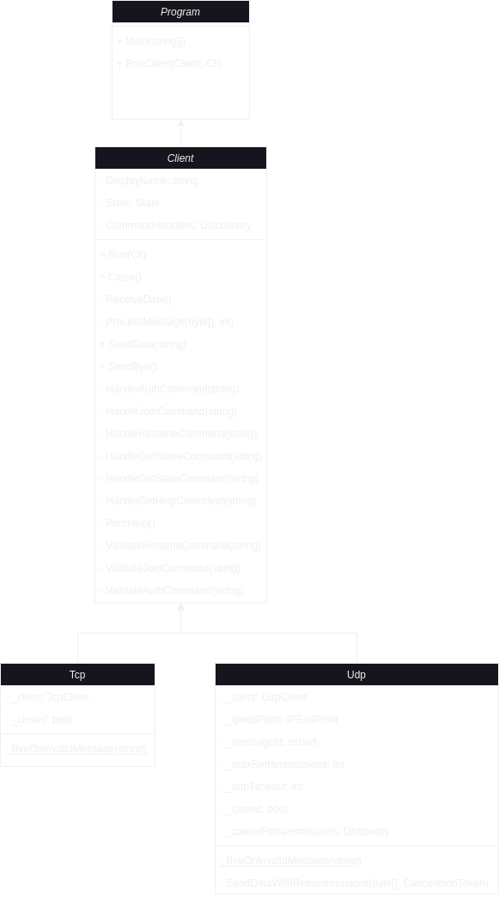

# Table of Contents

IPK24 Chat client

- [Executive Summary](#summary)
- [Implementation](#implementation)
  - [Tcp](#tcp)
  - [Udp](#udp)
- [Building the project](#building-the-project)
- [Usgae](#usage)
- [Testing](#testing)
  - [What was tested](#what-was-tested)
  - [How it was tested](#how-it-was-tested)
  - [Bug in Tests](#bug-in-tests)
- [Extra Features](#extra-features)
  - [/getname Command](#getname)
  - [/getstate Command](#getstate)
- [Bibliography](#bibliography)

## Summary

The IPK24 Chat client is a communication application using the IPK24-CHAT 
protocol. The protocol can be implemented using TCP and UDP.

The TCP protocol is a connection-oriented protocol that provides a reliable
flow of data between two computers. It offers guaranteed data delivery, 
ensuring that the entire message is received at the other end.

The UDP protocol sends data packets over the network without requiring
any acknowledgment. One benefit of this id faster data exchange. The
disadvantage of this is unreliable delivery, which means the client and the
server have to ensure that the data were successfully delivered.

## Implementation



The program begins by parsing the arguments and creating appropriate client
for the specified protocol. `client.Run()` method is called which connects 
the client to the server and new thread for handling incoming messages is 
created. Input from console si being read in a while loop and sent to 
appropriate function `client.SendData()`

### TCP

The TCP implementation is primarily managed by two concurrently running
functions:

#### 1. `ReceiveData` Function

The `ReceiveData` function handles receiving data from the server. The incoming
data is sent to the `ProcessMessage` function for further processing.

The `ProcessMessage` functions identifies the type of the message received
and handles it accordingly.

- When a Bye message is received, the connection is closed and the client
will terminate
- In case of an Err message, the error received is printed to the standard
error output using custom implementation of `Error.Print` function. It then
responds with Bye message and terminates teh client.
- Msg messages are formatted and printed to the console
- Reply messages are handled similarly, but receiving Reply in Open state will
result in error and termination of the client.
- In case a massage cannot be identified, is not according to the
specification or is unexpected, the `ByeOnInvalidMessage` functions is called,
connection is closed and client terminated.

#### 2. `SendData` Function

The `SendData` function is responsible for handling user commands and messages.
If user enters a command, it will be forwarded to a separate function 
which will handle sending the command to the server. Appropriate message packet
is created and sen to the server.

#### Serializing and Deserializing functions

Every message class contains additional methods for serializing messages
before they are sent to the server and deserializing incoming messages.
Before sending a message, these functions ensure all required properties
are set and verify that received messages are according to the specifications.

```csharp
public string SerializeTcpMessage() {
    ValidateMessage();
    
    return $"MSG FROM {DisplayName} IS {MessageContents}\r\n";
}

public void DeserializeTcpMessage(string message) {
    const string pattern = @"^MSG FROM (?<DisplayName>\S+) IS (?<MessageContent>.+)(\r\n)$";
    var match = Regex.Match(message, pattern, RegexOptions.IgnoreCase);

    if (!match.Success) {
    	throw new ArgumentException("Invalid message format");
    }

    Type = MessageType.Msg;
    DisplayName = match.Groups["DisplayName"].Value;
    MessageContents = match.Groups["MessageContent"].Value;
}
```

### UDP

The code implementing the UDP protocol is present in this project, but the
implementation is not used and the code is not in functioning condition.


## Building the Project

To build the project, use the included makefile.<br>
Running `make` will compile the program and move the executable
to the root directory.

## Usage
```
./ipk24chat-client [-h] [-t transport_protocol] [-s server_address] [-p server_port] [-d udp_timeout] [-r max_retransmissions]
-t: Transport protocol (tcp or udp)
-s: Server address (IP or hostname)
-p: Server port (number)
-d: UDP confirmation timeout (number in milliseconds)
-r: Maximum number of UDP retransmissions (number)
```

## Testing

*Please note that only testing of the TCP protocol is mentioned in this 
section as the UDP version was not finished.*

### What was tested

All basic functionality was tested including handling commands. 
Testing was also done on unexpected behaviour from the server and 
input from the user.

### How it was tested

The initial phase of  testing was performed manually using the netcat program 
and the responses to the client were sent manually. This helped to test the basic
functionality of the client. <br>

```bash
while true; do nc -l -c -p 4567; done
```

Here are few examples of client and server output

Numbers on the begging of the line represent the order of the messages 

Example 1
```
[Client] ./ipk24chat-client -t tcp -s localhost
[01] /auth test test test
[04] Success: ok
[05] Ahoj
[07] /join channel2
[09] Test
[10] ERR: Cannot send a message when not connected to the server.
[12] Success: channel2
```
```
[Server] while true; do nc -l -c -p 4567; done
[02] AUTH test AS test USING test
[03] REPLY OK IS ok
[06] MSG FROM test IS Ahoj
[08] JOIN channel2 AS test
[11] REPLY OK IS channel2
```

Example 2
```
[Client] ./ipk24chat-client -t tcp -s localhost
[1] /auth test test test
[4] ERR: Received invalid message. Closing the connection.
```
```
[Server] while true; do nc -l -c -p 4567; done
[2] AUTH test AS test USING test
[3] Ahoj
[5] ERR FROM test IS Unexpected or malformed message.
[6] BYE
```

Further testing was done on an unofficial student run testing server, 
despite the server not being up to the specifications, this helped with
eliminating many more bugs. Not being up to specifications in fact helped 
with testing of handling unexpected behaviour from the server eg. receiving 
non-ASCII message or message tact is too long.

Additional testing was done on the official integration with Discord to ensure
the client is compliant with the protocol.

## Extra Features

### /getname

The `/getname` command is used to retrieve the current display name. This command 
was originally implemented for testing purposes, but can be also useful in
cases where user forgets their display name.

### /getstate

The `/getstate` command returns the current state of the client. This command was
as well developed for testing purposes, but unlike /getname, this one probably won't
be as useful for end user.

## Bibliography

Cloudflare, What is TCP/IP? [online] 2023 [cit. 2023-04-01]. Available at: https://www.cloudflare.com/en-gb/learning/ddos/glossary/tcp-ip/

Cloudflare, What is UDP? [online] 2023 [cit. 2023-04-01]. Available at: https://www.cloudflare.com/en-gb/learning/ddos/glossary/user-datagram-protocol-udp/


